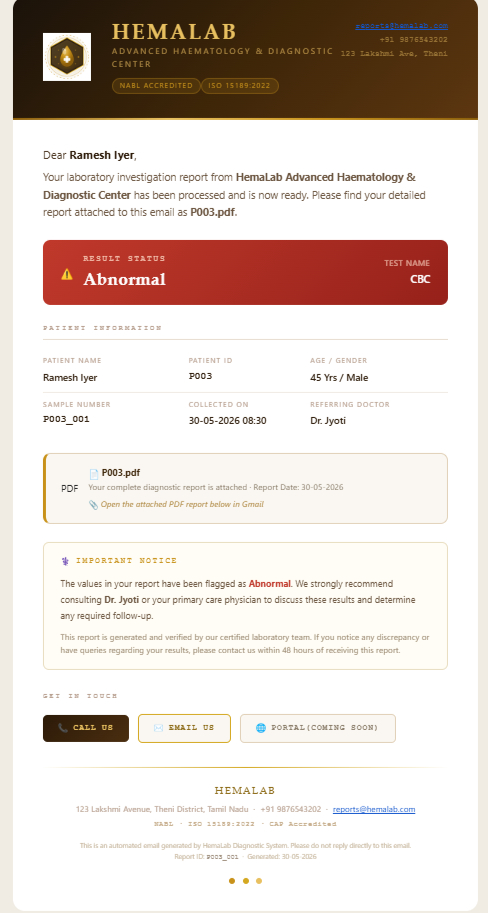

# 🏥 Medical Lab Report Automation System

> **An Intelligent UiPath-based RPA solution that automates laboratory report processing using age- and gender-specific validation, generates professional PDF reports, and delivers them securely via email.**

---

## 📌 Project Overview

Medical laboratories often spend significant time manually validating patient test results, preparing reports, and emailing them to patients. This project automates the complete workflow using **UiPath**, reducing manual effort, improving accuracy, and delivering reports faster.

The automation reads patient information from Excel, validates laboratory values against age- and gender-specific reference ranges, generates a professional HTML/PDF report, and emails the report automatically.

---

# ✨ Key Features

* 📄 Automated patient data processing
* 👨‍⚕️ Age-based reference range validation
* 🚻 Gender-based medical validation
* ⚠️ Normal / Abnormal result detection
* 📑 Professional HTML report generation
* 📄 Automatic PDF conversion
* 📧 Automated email delivery with PDF attachment
* 🔐 Secure credential management using UiPath Orchestrator Assets
* 📊 JSON-based configurable reference ranges
* ♻️ Modular and reusable UiPath workflows

---

# 🛠 Technologies Used

* UiPath Studio
* UiPath Orchestrator
* Excel Automation
* HTML & CSS
* JSON
* SMTP Email Automation
* PDF Generation

---

# 📂 Project Structure

```text
Medical-Lab-Report-Automation-System
│
├── Main.xaml
├── Master.xaml
├── AddQueueItems.xaml
├── Data
│   ├── Config
│   └── Input
├── Templates
│   ├── HemaLab_Email_Template.html
│   ├── HemaLab_Report_.html
│   └── Images
├── Screenshots
└── project.json
```

---

# 🔄 Workflow

```text
Patient Excel
      │
      ▼
Read Patient Data
      │
      ▼
Validate Age & Gender
      │
      ▼
Generate HTML Report
      │
      ▼
Convert HTML to PDF
      │
      ▼
Send Email with Attachment
```

---

# 📸 Project Screenshots

## 📧 Automated Email Notification

The system automatically sends a professional email containing the patient's laboratory report.



---

## 📄 Generated Laboratory Report (Page 1)

The first page of the report contains patient information, laboratory test results, reference ranges, and abnormal value highlighting.

.png)

---

## 📄 Generated Laboratory Report (Page 2)

The second page includes laboratory verification, technician and pathologist authorization, and report completion details.

.png)

---

## 📥 Sample PDF Report

[Download Sample PDF Report](Screenshots/P003.pdf)

# 🔐 Security

This project **does not store passwords inside the workflow**.

Email credentials are securely managed using **UiPath Orchestrator Assets**, following recommended credential management practices.

---

# 🚀 Future Enhancements

* OCR integration for scanned reports
* Database integration
* Patient web portal
* Dashboard & analytics
* Multi-language support
* Cloud deployment
* SMS & WhatsApp notifications

---

# 👩‍💻 Author

**Monica N**

Computer Science Engineering Student

Passionate about RPA, Automation, Software Development.

---

## ⭐ If you found this project interesting, consider giving it a Star.

